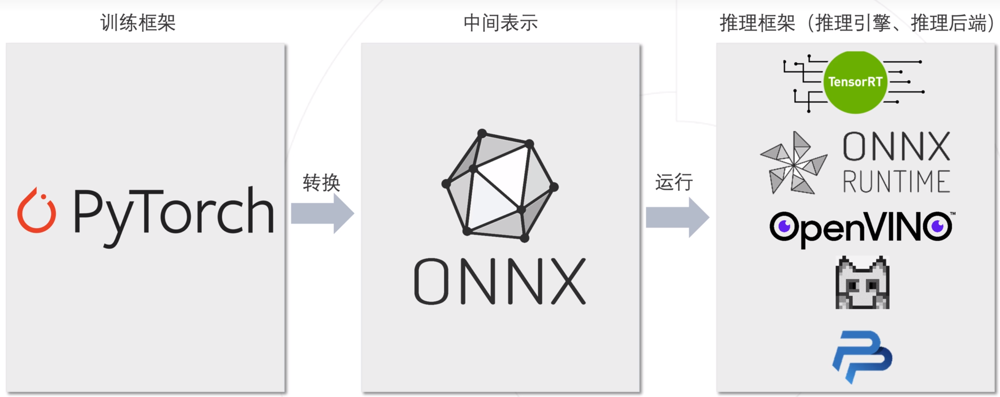

# 模型终端部署

## 1. 开发部署流程：


## 2. PyTorch模型部署通用流程：




## 3. 环境配置：

### 3.1 本地机器：

```bash
# 安装pytorch
pip install torch torchvision torchaudio

# 安装onnx
pip install onnx -i https://pypi.tuna.tsinghua.edu.cn/simple

# 安装推理引擎onnx RT
pip install onnxruntime -i https://pypi.tuna.tsinghua.edu.cn/simple

# 其他可用依赖
pip install numpy pandas matplotlib opencv-python pillow -i https://pypi.tuna.tsinghua.edu.cn/simple
```

### 3.2 ARM机器 -- 松灵小车：

```bash
# 安装基础工具包
pip install numpy pandas matplotlib opencv-python pillow onnx onnxruntime -i https://pypi.tuna.tsinghua.edu.cn/simple

# 安装pytorch (不要有其他额外操作，会自动匹配下载arm-torch)
pip install torch torchvision torchaudio
```

## 4. pth格式转onnx格式：

**eg:** *torch2onnx.py*

(这一步在本地机器上执行，之后导出onnx模型之后scp或者ftp到松林小车上)

```python
import torch
import torch.nn as nn
import onnx

# here is your Net
class Alexnet(nn.Module):
    def __init__(self, output_dim):
        super().__init__()

        self.features = nn.Sequential(
            nn.Conv2d(in_channels=3, out_channels=64,
                      kernel_size=3, stride=2, padding=1),
            nn.MaxPool2d(kernel_size=2),
            nn.ReLU(inplace=True),

            nn.Conv2d(in_channels=64, out_channels=192,
                      kernel_size=3, padding=1),
            nn.MaxPool2d(kernel_size=2),
            nn.ReLU(inplace=True),

            nn.Conv2d(in_channels=192, out_channels=384,
                      kernel_size=3, padding=1),
            nn.ReLU(inplace=True),

            nn.Conv2d(in_channels=384, out_channels=256,
                      kernel_size=3, padding=1),
            nn.ReLU(inplace=True),

            nn.Conv2d(in_channels=256, out_channels=256,
                      kernel_size=3, padding=1),
            nn.MaxPool2d(kernel_size=2),
            nn.ReLU(inplace=True),
        )

        self.classifier = nn.Sequential(
            nn.Dropout(0.5),
            nn.Linear(256*7*7, 1000),
            nn.ReLU(inplace=True),

            nn.Dropout(0.5),
            nn.Linear(in_features=1000, out_features=256),
            nn.ReLU(inplace=True),

            nn.Linear(256, output_dim)
        )

    def forward(self, x):
        x = self.features(x)
        h = x.view(x.shape[0], -1)
        x = self.classifier(h)
        return x

# 43 classes
numClasses = 43

# 加载pth模型
model = Alexnet(numClasses)
model.load_state_dict(torch.load('../checkpoints/tsr_alexnet_30epochs.pth'))

# eval mode
model.eval() 

# 构造图像输入tensor
example_input = torch.randn(1, 3, 112, 112)

# output onnx
output_onnx_file = '../checkpoints/tsr_alexnet_30epochs_v2.onnx'
torch.onnx.export(model,
                  example_input,
                  output_onnx_file,
                  export_params=True,
                  opset_version=13,  # 可选版本
                  do_constant_folding=True,  # 优化模型
                  input_names=['input'],
                  output_names=['output'])

# 验证模型
onnx_model = onnx.load(output_onnx_file)
onnx.checker.check_model(onnx_model)

print("ONNX output successful!")
```

----

**ps: 得到onnx格式的模型之后即可部署到arm机器上进行模型调用推理**
